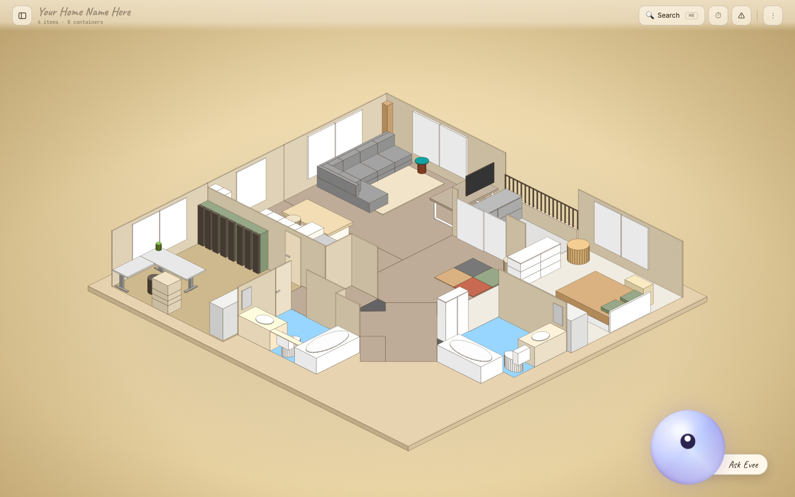
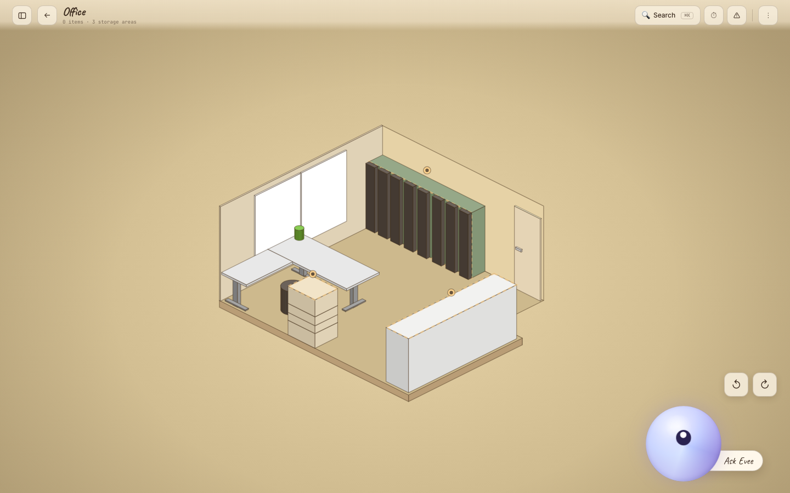
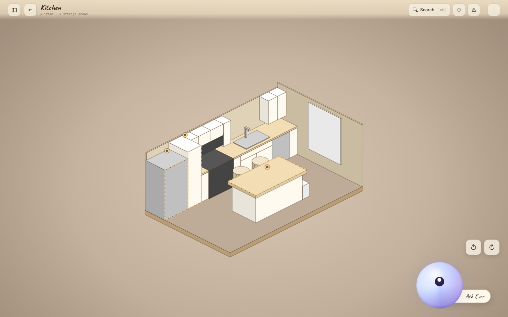
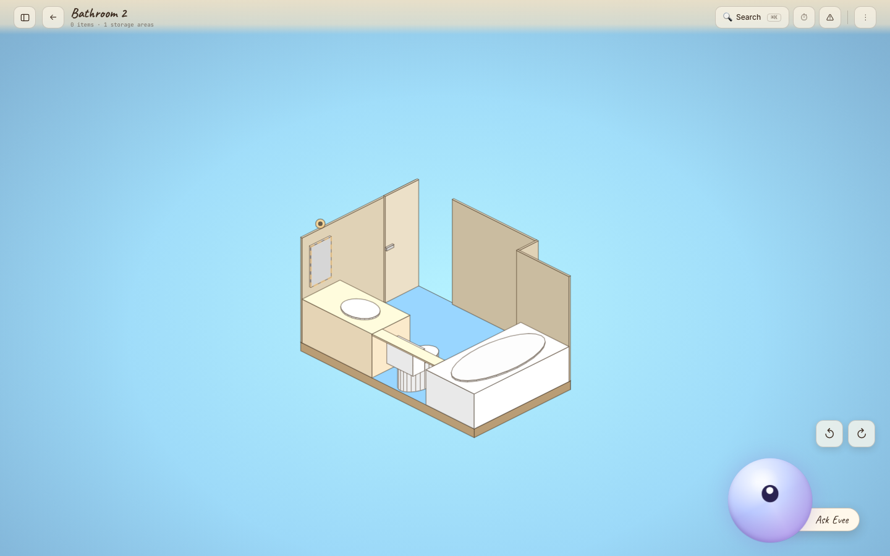
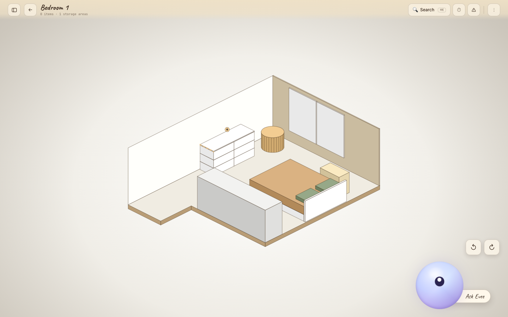
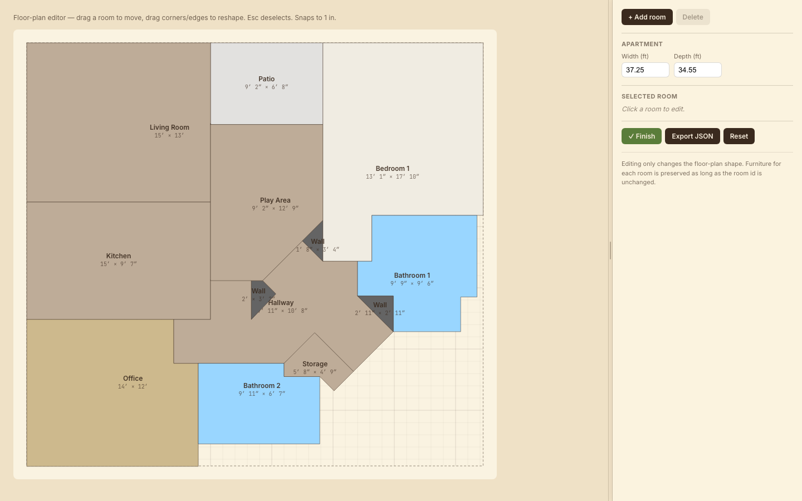

# Evee

**Above average Home Assistant** — an interactive isometric apartment for tracking what you own and where it lives.

> **Status** — Evee is a personal project I run in my own home. This repository is a
> published snapshot for reading, not a maintained release: development continues in a
> private repo, issues and pull requests aren't being accepted, and what's here may lag
> what I'm actually running. The commit history below is organized by subsystem rather
> than chronologically — it's an export, not the original development log.



---

## What it is

Evee is a browser-based home-inventory app. You get a dollhouse isometric view of your apartment, click into any room, and track what's stored where. The whole floor plan is editable: reshape rooms, place furniture, mark pieces as storage containers, and assign items to them.

No build step — React 18 + Babel are loaded from CDN and JSX is transformed in-browser. A thin Python server (`serve.py`) serves the app and powers the optional inventory, chat, and voice backends; everything degrades gracefully when those aren't configured.

---

## Features

- **Isometric apartment view** — click any room to zoom in
- **Room editor** — place, resize, reorder, and group furniture pieces
- **Floor-plan editor** — reshape room polygons, drag vertices, split edges
- **Storage tracking** — tag furniture as containers, assign items, search across rooms
- **AI assistant** — talk or type to Evee; she updates your inventory in plain language (Claude)
- **Voice** — Evee listens (tap-to-talk) and speaks her replies aloud (ElevenLabs)

| Office | Kitchen |
|--------|---------|
|  |  |

| Bathroom | Bedroom |
|----------|---------|
|  |  |



---

## Getting started

Requires a local HTTP server (Babel Standalone fetches `.jsx` files via XHR, which browsers block on `file://`).

```sh
# Quickstart — starts a server and opens the app
./start.sh

# Or manually
python3 serve.py 8000
# then open http://localhost:8000/Evee.html
```

---

## Notion inventory backend

Inventory items live in **Notion** (the floor-plan layout stays in
`localStorage`). `serve.py` doubles as a thin backend: it serves the static app
*and* exposes `/api/inventory`, which proxies to the Notion API server-to-server
— so your Notion token never reaches the browser and there's no CORS issue. The
app degrades gracefully (legacy counts, read-only) when this isn't configured.

One-time setup:

1. In Notion, create a database named **Evee Inventory** with these columns
   (exact names): `Name` (title), `Quantity` (number), `Notes` (text),
   `Container` (text), `Room` (text), `Container ID` (text), `Room ID` (text).
2. Create an integration at <https://www.notion.so/my-integrations> →
   **New integration**. When asked for the type, choose **Internal** /
   **Access token** (not OAuth — that's only for apps other people install).
   On the integration's **Configuration** tab, reveal and copy the
   **Internal Integration Secret** — this is your token (starts with `ntn_`).
3. On the database, open it as a full page → `•••` → **Connections** → add your
   integration. (Without this the token can't see the database.)
4. `cp .env.example .env`, then set the two values:
   - `NOTION_TOKEN=` → the `ntn_…` secret from step 2.
   - `NOTION_DATABASE_ID=` → from the database's **Share → Copy link**, take the
     32-char hex id **between the last `/` and `?v=`**. Ignore any
     `Title-Name-` prefix, the `?v=<view id>`, and a trailing `&source=copy_link`.
     Example link → id:
     ```
     https://www.notion.so/0123456789abcdef0123456789abcdef?v=133a…&source=copy_link
                           └────────── NOTION_DATABASE_ID ──────────┘
     ```

   `serve.py` loads `.env` at startup (restart it after editing).

`Container ID` / `Room ID` join each item row back to the app's storage areas
and rooms.

---

## AI assistant (chat)

Evee's chat is backed by Claude (Anthropic Messages API tool-use loop). Ask it
to update inventory in plain language — *"add two cans of beans to the pantry"*,
*"how many AA batteries do I have?"* — and it calls the **same**
`inventory_service` functions the manual panel uses, so its edits land in the
same Notion database. The scene refreshes automatically after a change.

Setup (in addition to the Notion steps above):

```sh
pip install -r requirements.txt          # installs the `anthropic` SDK
# add to .env:
#   ANTHROPIC_API_KEY=...   (from https://console.anthropic.com/settings/keys)
```

The default model is `claude-haiku-4-5` (fast, cheap); override with
`ANTHROPIC_MODEL` in `.env`. Without a key the rest of the app works normally —
the chat just replies that it's not configured. Implemented in
[chat_service.py](chat_service.py) (tools wrap `inventory_service`), served at
`/api/chat`, called from [hifi/app.jsx](hifi/app.jsx) `sendUserMessage`.

---

## Voice (Evee speaks + listens)

Evee can **listen** to you and **talk back** in a natural voice:

- **Speech-to-text** records with `MediaRecorder` and transcribes server-side
  (`/api/stt` → ElevenLabs Scribe) — tap the blob at the bottom-right, talk, and
  it sends when you pause. This replaced the browser's Web Speech API, which is
  Chrome-only and, on iOS, never releases the microphone (see the note below).
- **Text-to-speech** uses **ElevenLabs** for a natural voice, synthesized
  server-side (`/api/tts`) so the key never reaches the browser. It's **optional**
  — without it Evee still chats as text, just silently. Mute/unmute any time with
  the 🔊 toggle in the chat header.

Setup (optional):

1. Create an ElevenLabs account, then an **API key**: dashboard → **API Keys** →
   **Create Key**. Copy it on creation — it's shown only once (starts with `sk_`).
2. Give the key both **Text to Speech** *and* **Speech to Text** permissions —
   keys are scoped per capability, and a TTS-only key fails STT with
   *"missing the permission speech_to_text"*.
3. Pick a voice in the ElevenLabs **Voices** library and use **Copy Voice ID**.
4. Add the values to `.env`:

```sh
ELEVENLABS_API_KEY=sk_...
ELEVENLABS_VOICE_ID=...
# ELEVENLABS_MODEL=eleven_flash_v2_5   # optional; default — Flash = lowest latency
```

No extra packages needed — [tts_service.py](tts_service.py) and
[stt_service.py](stt_service.py) are both stdlib-only. Restart `serve.py` after
editing `.env` — the startup log prints `ElevenLabs voice: configured` when it's
picked up. Speech out is served at `/api/tts` and played by
[hifi/chat.jsx](hifi/chat.jsx)'s `useSpeech`; speech in is posted to `/api/stt`
by its `useSpeechRecognition`.

**Why not the browser's Web Speech API?** It never exposes its `MediaStream`, so
its microphone capture cannot be released. On iOS that leaves the audio session
stuck in `playAndRecord`, which routes playback down the call path — every reply
after the first mic use comes out quiet and echo-cancelled — and leaves the mic
itself unreliable. Owning the stream via `MediaRecorder` lets us call
`track.stop()` and hand the session back. It also works in Firefox, which has no
Web Speech at all.

---

## Backups

Notion keeps deleted rows in Trash for 30 days, but [backup.py](backup.py) adds
point-in-time JSON snapshots (uses the same `.env`, no extra deps):

```sh
python3 backup.py        # writes backups/evee-inventory-<timestamp>.json (keeps last 30)
```

To run it daily, install the launchd agent:

```sh
cp launchd/com.evee.inventory-backup.plist ~/Library/LaunchAgents/
launchctl bootstrap gui/$(id -u) ~/Library/LaunchAgents/com.evee.inventory-backup.plist
launchctl kickstart -k gui/$(id -u)/com.evee.inventory-backup   # run once now
# uninstall: launchctl bootout gui/$(id -u)/com.evee.inventory-backup
```

---

## Project structure

```
Evee.html             ← HTML shell + CDN tags + <script> load order
hifi/
  iso.jsx             ← isometric projection helpers
  world.jsx           ← apartment / furniture / storage / inventory data
  scenes.jsx          ← HomeScene, RoomScene, depth sort
  chat.jsx            ← chat UI shell + voice hooks (useSpeechRecognition / useSpeech)
  panels.jsx          ← side panels (item list), overlays
  editor.jsx          ← floor-plan editor (whole apartment)
  room-editor.jsx     ← room interior editor (furniture)
  api.jsx             ← fetch helpers for the backend (inventory, chat, voice)
  app.jsx             ← top-level state, routing, keyboard shortcuts
serve.py              ← dev server + /api/inventory, /api/chat, /api/tts proxies
inventory_service.py  ← Notion REST mapping (shared by manual edits + AI tools)
chat_service.py       ← AI chat: Anthropic Messages API tool-use loop
tts_service.py        ← Evee's voice: ElevenLabs TTS (served at /api/tts)
backup.py             ← snapshot the Notion DB to backups/*.json
launchd/              ← macOS launchd agent to run backup.py daily
.env.example          ← NOTION_TOKEN / NOTION_DATABASE_ID / ANTHROPIC_API_KEY / ELEVENLABS_*
screenshots/          ← reference PNGs (not loaded by the app)
home.json             ← the seeded default layout (seeds world.jsx defaults)
```

---

## License

**PolyForm Strict 1.0.0** — see [LICENSE](LICENSE). This is *source-available*,
not open source.

You're welcome to read this code, study it, and run it locally for personal,
noncommercial learning. The license does **not** grant permission to
redistribute it, publish it, build derivative works from it, or use it
commercially. If you want to do something it doesn't cover, ask.

And the plain-English version of the part that matters most to me: please don't
present this project, or a derivative of it, as your own work.
